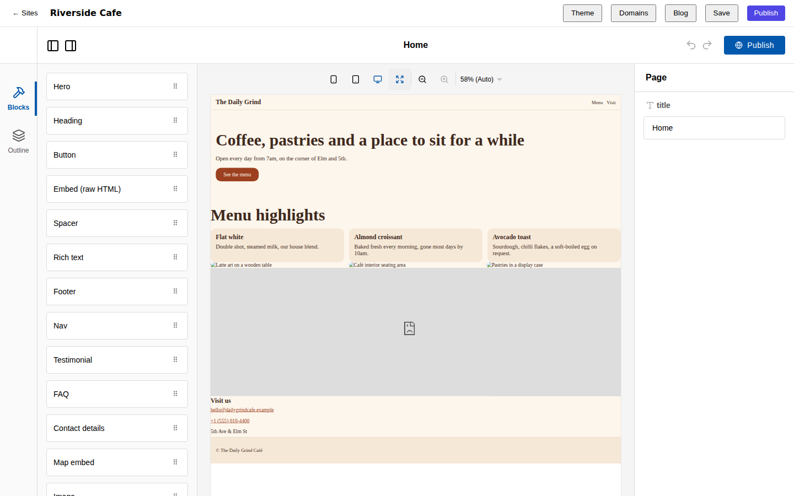
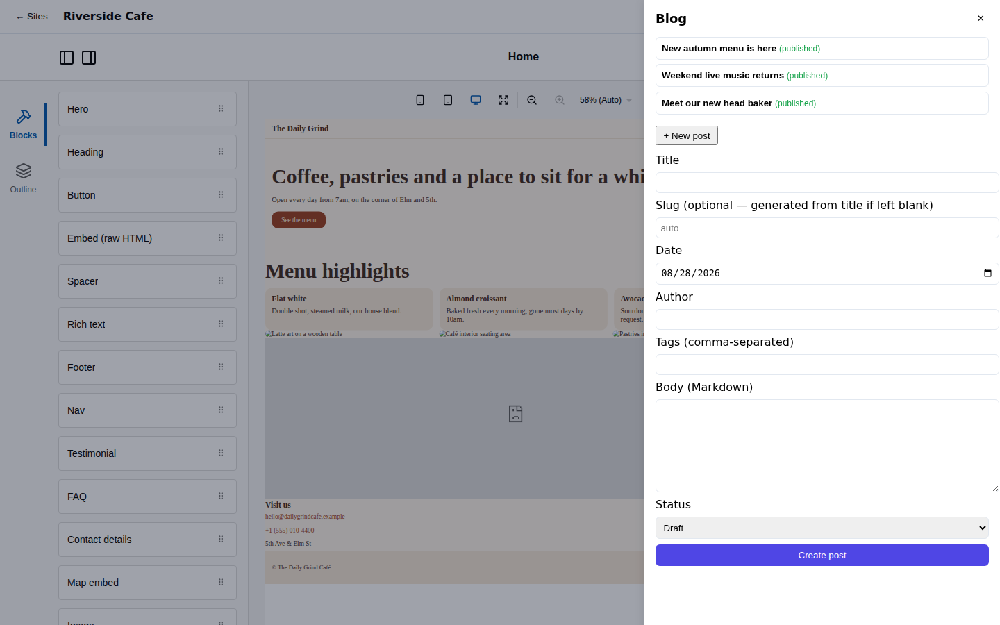
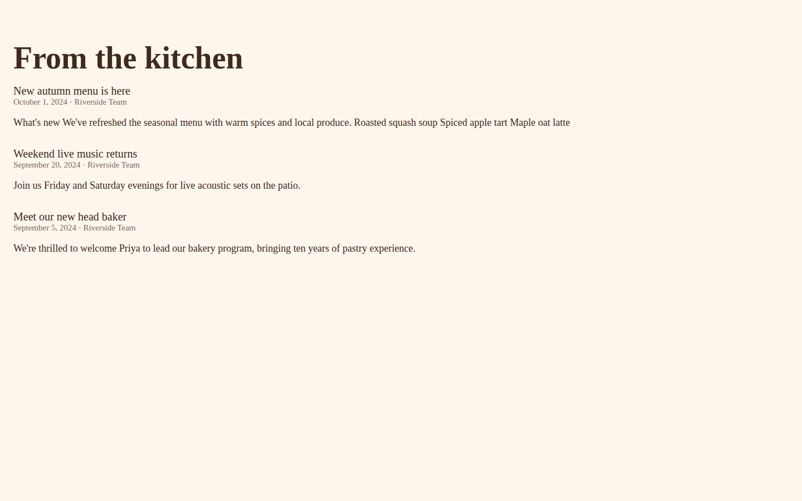
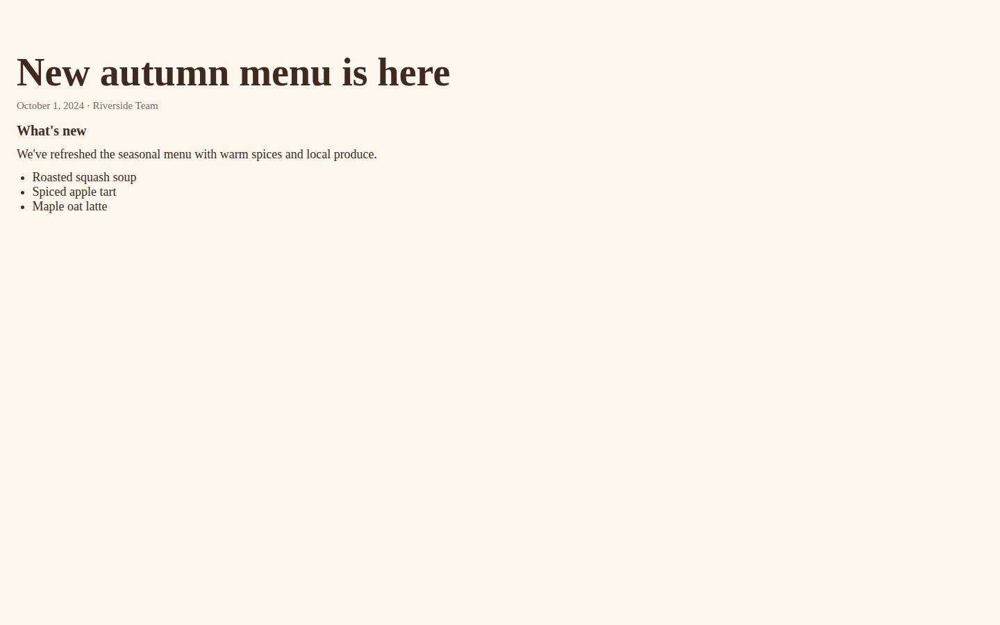

# pre-fab

A no-code website builder where the site is a portable, diffable artifact the
customer owns. See `PLAN.md` for the problem and requirements (`R1`–`R20`),
`docs/adr/` for binding decisions, and `SLICES.md` for the build sequence.

|                                                    |                                                  |
| -------------------------------------------------- | ------------------------------------------------ |
|  |  |
|  |  |

*Top row: the Puck canvas editing a forked template, and Slice 5's blog admin
panel. Bottom row: the published blog index and a published post page — all
rendered by the actual static publish pipeline, not mockups.*

**Status: Slices 1–7 are built.** Slice 1 proved the one-write-path loop with
a single Hero block: create, edit in the Puck canvas, edit by CLI/MCP/pull-push
round trip, publish to a live, rollback-able bundle. Slice 2 added the full
first-party block library, theme tokens, block-level responsive overrides and
content-addressed asset uploads. Slice 3 adds real signup and email
verification (`dev/login` still exists, for local dev and tests), eight
templates authored as exported site trees with fork-on-use instantiation
(ADR-0011), a guided first edit and a publish celebration moment, and
Lighthouse/axe-core budgets per template in CI. Slice 4 adds custom domains:
DNS validation and apex/subdomain classification, a Cloudflare SSL-for-SaaS
integration behind a provider interface, a dashboard panel with DNS
instructions and actionable errors, and the Host-header-based public routing
that also makes every site's free `<slug>.PUBLIC_SITE_HOST` address work for
the first time. Slice 5 adds blog and collections: posts as their own
collection (title, slug, date, author, tags, body, cover, draft/published
state), a frontmatter-plus-Markdown file format for `pull`/`push` (pleasant to
hand-edit, unlike the raw `pages/*.json`), `postlist`/`postdetail` block types
that turn a page into a paginated index or a per-post detail template, RSS
and sitemap generation, and a blog admin panel in the editor. Slice 6 adds
forms and submissions — the first dynamic behaviour, and the slice where the
runtime API (ADR-0007) is born: a `Form` block with a field builder
(text/email/textarea/select/checkbox/file), a new `packages/runtime` package
implementing form submission with no dependency on any control-plane package
(ADR-0010, enforced by `pnpm run ci:containment`), submission storage in
platform Postgres only, never the site tree (R20), per-IP/per-site rate
limiting and optional Cloudflare Turnstile, notification email and webhook
delivery with retry/backoff, CSV/JSON export, per-record deletion (PDPA/GDPR),
and a submissions panel in the editor. Slice 7 cashes in the anti-lock-in
promise (ADR-0010): `apps/self-host`, an Apache-2.0 runtime that serves an
exported bundle and reimplements `@prefab/runtime`'s storage interfaces
against SQLite instead of Postgres — `submitForm` itself runs completely
unchanged — so forms keep working with zero pre-fab infrastructure
reachable (R10); `prefab export-bundle`, tier (a)'s self-contained static
bundle plus an import manifest declaring its schema version and how far
back an import is still accepted from; `prefab eject`, tier (c)'s
standalone Astro project generator, which vendors the handful of
`@prefab/schema` runtime helpers `@prefab/blocks` actually needs and copies
every block's source byte-for-byte, so the ejected project builds with
plain `npm install && npm run build` and has zero `@prefab/*` dependencies
(R11); and a screenshot-diff fidelity harness (`tools/checks`'s own
`ci:fidelity` job) proving every first-party block renders within 0.1%
pixel delta between the hosted pipeline and an ejected-and-rebuilt project
(R9).

One thing worth knowing about Slice 7 specifically: the fidelity harness
doesn't compare the hosted site against a second, hand-maintained renderer
— it reuses the *exact same* `SITE_PAGE_ASTRO` template tier (a) and the
hosted pipeline both already build with (`@prefab/publish`'s
`page-template.ts`), so a fidelity regression can only come from the eject
generator's own vendoring/aliasing, never from two templates drifting out
of sync with each other. See `apps/self-host/README.md` for the self-host
runtime's configuration, backup and upgrade story, including the one thing
that's deliberately *not* portable in an exported bundle: a form's
notification email and webhook secret (R20) are configured directly
against the self-hosted instance, never written into `prefab-forms.json`.

One thing worth knowing about Slice 6 specifically: the Form block is the
first block that ships client-side JS at all (`client:load` hydration in
`@prefab/publish`'s page template) — every other first-party block ships
zero JS (ADR-0007). Getting that working surfaced a real, previously
harmless bug: bundle serving (`apps/api`'s `serveBundleFile`) served every
non-`.html` file as `application/octet-stream`, which browsers refuse to
execute as a module script. Fixed with a small content-type map; see the
comment beside `BUNDLE_CONTENT_TYPE_BY_EXTENSION` in `apps/api/src/app.ts`.

One thing worth knowing about Slice 5 specifically: a post's visibility is a
pure function of `status` and `date` (`@prefab/schema`'s `isPostVisible`) —
there is no separate "scheduled" state. `apps/api`'s `publish.create` filters
to visible posts *before* handing them to `@prefab/publish`, so a draft or a
future-dated post is never even built into a route, let alone served.

Two things worth knowing about Slice 4 specifically, and the same is true of
three Slice 6 adapters (`ResendEmailSender` in `apps/api/src/lib/email.ts`,
`CloudflareTurnstileVerifier` in `apps/api/src/lib/turnstile.ts`, and the
webhook dispatcher in `apps/api/src/lib/webhooks.ts`, whose retry/backoff
logic is fully unit- and integration-tested but has never delivered to a
real third-party endpoint):

- **No Cloudflare account or domain exists in this environment**, so every
  test here runs against an in-memory `FakeDomainProvider`
  (`apps/api/src/lib/domain-provider.ts`) rather than real Cloudflare — the
  same "sandbox or a recorded fixture" testing approach PLAN.md already
  commits to for Stripe/calendar providers. `CloudflareDomainProvider` in the
  same file is written from Cloudflare's public API docs but has never been
  run against a live account; treat it as an informed draft, not a verified
  integration, until it's exercised against a real zone.
- Slice 3's R1 acceptance test — five unassisted first-time users reaching a
  published site in under ten minutes, on recorded sessions — is a human user
  study and isn't something this repo's automation can certify by itself; the
  Playwright specs and the per-template Lighthouse/axe budgets are the
  automatable parts of that bar.

## Monorepo layout

```
apps/
  api/            HTTP API — the one write path (mutations, auth, publish)
  cli/            prefab CLI — commander, wraps packages/commands
  mcp/             MCP server — stdio, wraps packages/commands
  editor/         Puck canvas SPA (Vite + React 19)
  self-host/      Slice 7, ADR-0010 tier b: Apache-2.0 self-host runtime —
                   serves a bundle, implements the runtime API against SQLite
packages/
  schema/          document model: ULIDs, Zod validation, flat block tree, diff,
                   posts (Slice 5) and their frontmatter+Markdown file format
  blocks/          first-party block components — SSR-safe, no Puck import;
                   includes postlist/postdetail (Slice 5)
  puck-adapter/    translates the flat schema <-> Puck's content/zones shape
  db/              Postgres access + migrations, RLS keyed on site_id
  api-client/      typed HTTP client shared by the CLI, MCP server and editor
  publish/         Astro build pipeline — content-addressed bundles, atomic
                   pointer swap, RSS/sitemap generation (Slice 5); eject.ts
                   generates tier (c)'s standalone Astro project (Slice 7)
  commands/        one command registry the CLI and MCP server both wrap (R12 parity)
  templates/       eight templates authored as exported site trees (ADR-0011);
                   `pnpm --filter @prefab/templates run generate` regenerates them
  runtime/         Slice 6: the runtime API's storage-agnostic logic (validation,
                   rate limiting, webhook backoff, CSV export) — zero dependency on
                   any control-plane package (ADR-0010); apps/api wires it to Postgres
tools/
  checks/          CI containment, parity, per-template Lighthouse/axe budget
                   checks, and the eject-vs-hosted fidelity harness (Slice 7, R9)
e2e/               Playwright acceptance tests, one per SLICES.md scenario
scripts/           local Postgres setup
```

Package boundaries are load-bearing, not aesthetic — three of them are
enforced by CI (`pnpm run ci:containment`, `pnpm run ci:parity`):

1. Nothing outside `packages/publish` imports Astro.
2. `packages/blocks` never imports Puck context, and never touches a
   browser-only global outside a `useEffect`.
3. Every mutation registered in `apps/api/src/mutations.ts` has a matching
   command in `packages/commands`, and every command is wired into
   `apps/cli/src/main.ts` — so the CLI and MCP server can never drift out of
   parity with the API.
4. `packages/runtime` and `apps/self-host` never import a control-plane
   package (`@prefab/db`, `@prefab/api-client`, `@prefab/commands`,
   `@prefab/blocks`, `@prefab/publish`, `@prefab/puck-adapter`) — Slice 6/7,
   ADR-0010. `apps/self-host` is the seam actually cashed in: it
   reimplements `@prefab/runtime`'s storage interfaces against SQLite, and
   `submitForm` itself (`packages/runtime/src/submit.ts`) runs unchanged
   against them.

## Prerequisites

- Node 22+
- pnpm 10 (`corepack enable` will pick up the pinned version from `package.json`)
- A local Postgres 16 with `sudo` access for `scripts/db-up.sh` (it starts the
  cluster and creates the `prefab` roles/databases; see that script and
  `scripts/db-init.sql` for exactly what it does)

## Local setup

```bash
pnpm install
cp .env.example .env        # then fill in each app's .env as noted below
pnpm run dev:db              # starts Postgres, creates prefab/prefab_app roles + dev/test/e2e DBs
pnpm run db:migrate          # runs packages/db/migrations against prefab_dev
```

`.env.example` documents every variable; the short version:

- `MIGRATE_DATABASE_URL(_TEST)` — the schema-owning role, used only by migrations.
- `DATABASE_URL(_TEST)` — the non-owner `prefab_app` role apps/api runs as, so
  RLS applies unconditionally (ADR-0008).
- `EDITOR_ORIGIN`, `VITE_PREFAB_API_URL` — apps/api and apps/editor need matching
  origins; the editor's Vite dev server also proxies `/v1` to the API so
  browser requests stay same-origin (cross-origin cookies are unreliable on
  `localhost` across ports).
- `PREFAB_API_URL`, `PREFAB_TOKEN` — used by the CLI and MCP server.
- `CLOUDFLARE_API_TOKEN`, `CLOUDFLARE_ZONE_ID` — optional (Slice 4). Unset
  (the default everywhere, including CI) uses the fake domain provider.
- `RUNTIME_API_URL` — optional (Slice 6). Where a published site's Form
  island posts submissions to; unset means the island renders but declines
  to submit. `RESEND_API_KEY`/`RESEND_FROM_ADDRESS` and
  `TURNSTILE_SECRET_KEY`/`TURNSTILE_SITE_KEY` are likewise optional and
  default to the fake email outbox / a Turnstile verifier that always
  succeeds, same discipline as the Cloudflare domain vars above.

### Running the pieces

```bash
pnpm --filter @prefab/api run dev        # HTTP API on :8787
pnpm --filter @prefab/editor run dev     # Puck canvas on :5173 (proxies to the API)
pnpm --filter @prefab/cli run start -- --help
pnpm --filter @prefab/mcp run start      # stdio MCP server; needs PREFAB_TOKEN
```

For a first site: open the editor at `http://localhost:5173` and either sign
up for real (email + a 6-digit code — read the code back from
`GET /v1/dev/emails?to=<email>`, the dev-only stand-in for an inbox) or
dev-login with any seeded email, then pick a template or start blank. Or from
the CLI: `prefab signup <email>` + `prefab verify <email> <code>` (or
`prefab login <email>` for the seeded-account shortcut), `prefab template list`,
`prefab template use <templateId> <slug> <name>`, `prefab pull`, edit
`pages/*.json`, `prefab push`, `prefab publish`. Every site is already
reachable at `<slug>.<PUBLIC_SITE_HOST>` once published; `prefab domain add
<siteId> <hostname>` adds a custom one (`prefab domain list`/`verify`/`remove`
manage it from there). `prefab post create <siteId> <title>` adds a blog post
(`post list`/`get`/`write` manage it from there, and it shows up in `pull`'s
checkout as `posts/<slug>.md` — frontmatter + Markdown, not raw JSON).
A page's `Form` block fields are edited the normal way (Puck canvas field
builder, or by hand in `pages/*.json` via `pull`/`push`); its notification
email and webhook are platform-side settings, set with `prefab form
configure <siteId> <formId> --notify-email <email> --webhook-url <url>`
(`formId` is the block's own id). `prefab submission list/export/delete
<siteId> <formId>` manages what visitors have submitted.

Export (Slice 7, free on every plan, R7): `prefab export <siteId> <dir>` is
the file-tree projection round-trip already used by `pull`/`push`. The three
ADR-0010 tiers are `prefab export-bundle <siteId> <outDir> --runtime-api-url
<url>` (tier a: a self-contained static bundle plus `manifest.json`), running
`apps/self-host` against that bundle (tier b — see its own README), and
`prefab eject <siteId> <outDir>` (tier c: a standalone Astro project —
`cd <outDir> && npm install && npm run build`, no `@prefab/*` dependency).

## Self-hosting a site

`apps/self-host` serves an exported bundle and keeps its forms working with
zero connection to pre-fab (R10):

```bash
prefab export-bundle <siteId> ./site --runtime-api-url http://localhost:8080
cd apps/self-host
BUNDLE_DIR=../../site DATA_DIR=./data npm run start
```

See `apps/self-host/README.md` for configuration, Docker, backups and
upgrades.

## Tests

```bash
pnpm run test:unit          # per-package, no external services
pnpm run test:integration   # per-package, against real Postgres (dev:db first)
pnpm run test:e2e           # Playwright, spins up its own api+editor+DB
pnpm run ci                 # lint + typecheck + containment + unit + parity
pnpm run ci:budgets         # per-template Lighthouse (R3) + axe-core (R6) budgets
pnpm run ci:fidelity        # Slice 7: hosted-vs-ejected pixel delta per block (R9)
```

Integration and e2e tests run against real Postgres and a real Astro build —
nothing here is mocked at the boundary CI actually cares about.

## CI

`.github/workflows/ci.yml` runs seven jobs on every push/PR: `lint-typecheck`,
`containment-and-parity` (the enforced invariants above), `unit-tests`,
`integration-tests` (Postgres 16 service container), `template-budgets`
(Lighthouse + axe-core per template, no database needed), `fidelity` (Slice
7's hosted-vs-ejected screenshot diff, R9 — its own job because it needs a
real `npm install` of the ejected project's dependency tree), and `e2e`
(Postgres 16 + `playwright install --with-deps chromium`).
